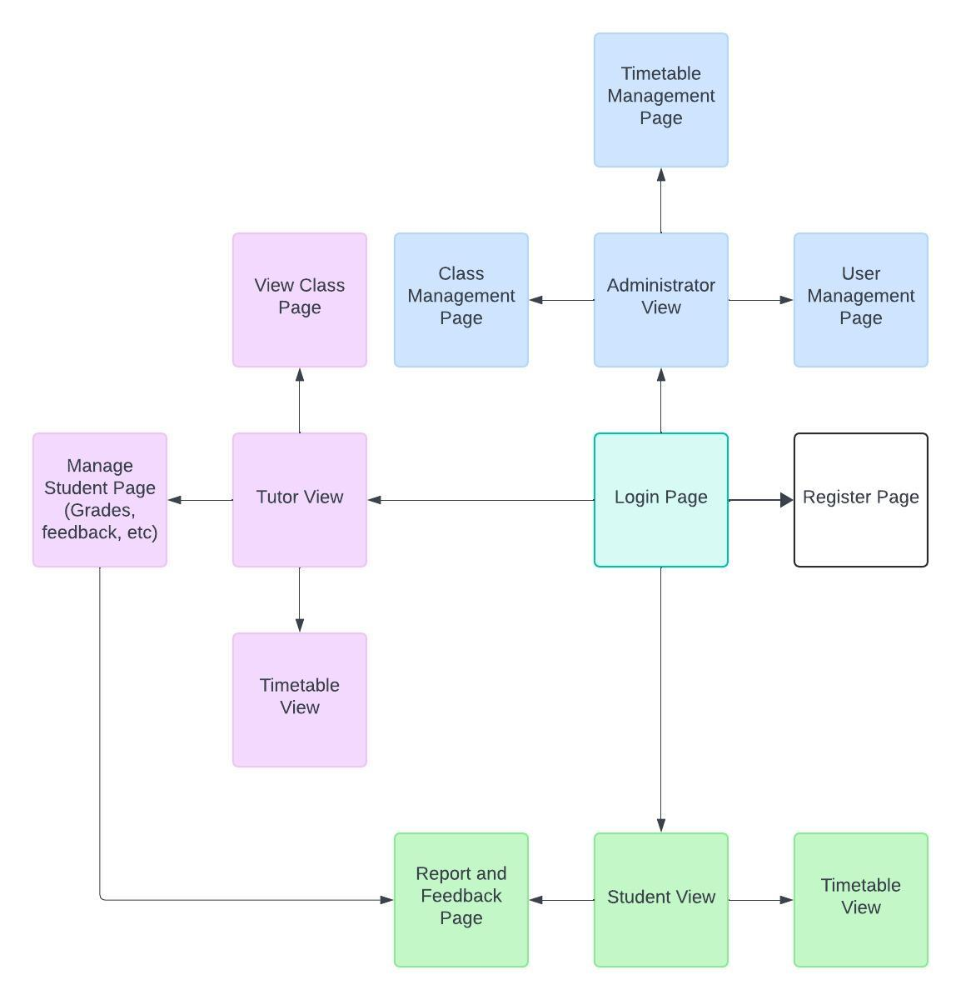

# Webpage Design proposal 1

After the discussion with group members on 28/03/2024, we have proposed the a design similar to the following flowchart:

    

## Login Stage:

A webpage which would at the very basic level have a form for credentials (email/username and password) and a button [Register].

## Register Stage:

The webpage will have a form for email and password. 

**TO-DO**
Think about the ways to verify the legitmacy of the account for sign up. Some proposed solutions are:
1. For students: using a class-allocation-key (which would be stored in a database where the administrator is able to access) to verify the classes that the user is signing up for.
2. For tutors: They should be signing up with a particular domain for email, e.g. @amazing-education.com.au. 
3. Administrators should not have to register as their credentials should be provided by the website. However, that may be modified once logged in.

## User pages (Tutor, Admin, Students)

Depending on the credentials stored in the database, the user will be directed to their relevant webpage for their particular role.

They have have an overview of their profile on that page, with links to other pages relevant to them as shown by the arrows in the diagram

**OR**

Everything clustered in one webpage.
